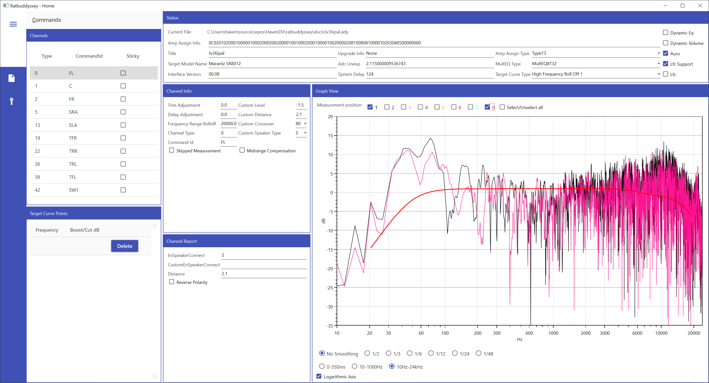

#  ratbuddyssey

Audyssey .ady file editor

https://www.avsforum.com/forum/90-receivers-amps-processors/3006886-announcing-ratbuddyssey-tool-tweaking-audyssey-multeq-app-files.html

Preview/early alpha release, for testing functionality of the .aud file parameter editing.

The program is a fork from ratbuddy/ratbudyssey and for educational and private use.

Please note that this program is highly unfinished.

New:

Implemented ethernet tcp/ip sniffer to capture filtered traffic.
As long as the sniffer is needed to learn and understand the traffic the program needs elevated rights.
Host (pc) IP address and target (receiver) IP address and port can be defined in json configuration files.
If these files do not exist at first run default files are created.

The file menu has two options added: ehernet and sniffer.
Ethernet enables replication of the protocol replicating the app to receiver data transfer.
These functions are temporarily disabled during development (except for two which query status and info from the receiver).
Sniffer attaches the ethernet packet sniffer to ethernet.

The sniffer writes captured packets data to file in aud format, attempts to fill the avr class from captured packets and writes the avr class to file. 

Important:
The sniffer needs elevated rights and the pc ethernet port must be connected to a switch port that port-replicates the receiver port.
Without elevated rights the sniffer cannot capture raw tcp packets.
Without replicated port on the switch the pc can not capture the receiver port when the app communicates with the receiver.
The app can run wireless on your usual device.
Sniffing while sending a profile from the app to the receiver is tested but may be unstable.
Sniffing the calibration process is not tested and behaviour is unknown.
In either case the program only sniffs and does not interfere with the communication between app and receiver.
